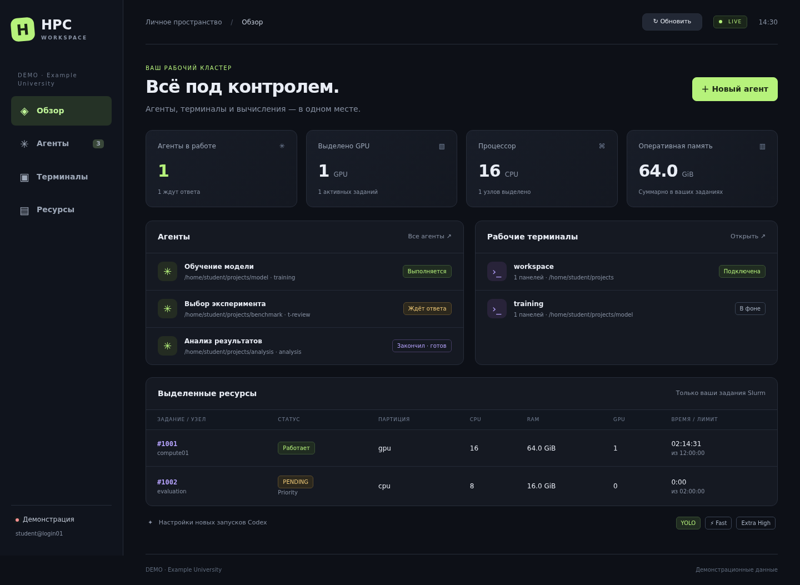
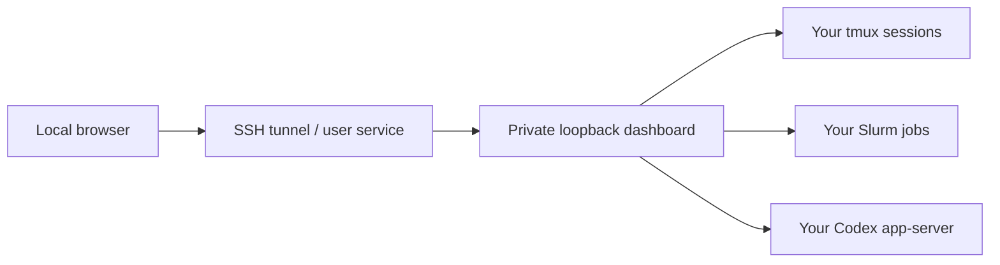

# HPC Workspace

A personal browser dashboard for **tmux sessions, Slurm resources and Codex agents** on a shared HPC cluster.

[Русская инструкция](docs/README.ru.md) · [Installation](docs/installation.md) · [Configuration](docs/configuration.md)

## What it does

- View your Slurm jobs, allocated resources, pending reasons and time limits.
- Create tmux sessions, read terminal output, send commands and selected keys.
- Start Codex conversations, send tasks, answer questions, interrupt work and open the same conversation in tmux.
- Hide agent sessions in a persistent archive and restore them with their history.
- Refresh immediately or receive automatic updates.
- Reconnect the SSH tunnel automatically after a network or VPN interruption.

The dashboard is private to one Unix account. Each student installs their own instance.
The web UI is currently in Russian.

## Quick start

**Local computer:** Linux, Python 3.10+, OpenSSH and a working systemd user session.
**Cluster:** Linux, Node.js 18.19+, tmux and Slurm commands. Codex CLI is optional for terminal/resource monitoring; the agents view needs Codex CLI with its app-server daemon and your own login. Tested with Codex **0.154.0**.

Configure an SSH alias pointing to a **fixed login node**, then connect once to establish and verify its host key. See [examples/ssh-config](examples/ssh-config).

```bash
ssh my-hpc hostname
git clone https://github.com/Vor-Art/HPC-Workspace.git
cd HPC-Workspace
./install.sh --host my-hpc
~/.local/bin/hpc-workspace open
```

The installer uploads the application to your own remote home, selects a free remote port, installs a local user service and enables automatic reconnection. The browser address defaults to `http://127.0.0.1:8765`.

If you already use that local port:

```bash
./install.sh --host my-hpc --local-port 8767
```

No root access or npm installation on the cluster is required. The installer transfers only application files; each student authenticates Codex separately. Read [the installation guide](docs/installation.md) for SSH keys, Codex login, updates and removal.

## Codex settings

The default installation inherits the student's Codex settings. To reproduce the original **YOLO / Fast / Extra High** profile explicitly:

```bash
./install.sh --host my-hpc --server-config examples/server.yolo.json
```

That profile grants Codex full filesystem/command access without approval prompts and requests the fast service tier. Model availability and service tiers depend on the student's own account. The installer does not rewrite `~/.codex/config.toml`.

On the cluster, use `hpc-codex` to create a terminal agent connected to the dashboard's shared daemon. If that command already existed before installation, it is preserved; use `hpc-workspace-server codex` instead.

## Resource limits

Slurm status comes from your account's live jobs. Per-user quota bars are optional configuration: another student's CPU/RAM/GPU limits are not used as your own. Add confirmed limits to `~/.config/hpc-workspace/server.json` on the cluster; see [configuration](docs/configuration.md).

The dashboard is a lightweight control service. Training, Python workloads and development jobs still run inside appropriate Slurm allocations. Choose a host on which your cluster permits this control service.

Adapt [examples/AGENTS.md](examples/AGENTS.md) for your own project to explain cluster usage to agents. The installer leaves existing agent instructions alone.

## Preview



The screenshot uses demo data. It does not represent a student's account or real cluster quotas.

## How it connects



Remote bootstrap and port forwarding share one SSH connection. The client verifies the login node selected at installation. Each instance uses a private access token and a separately selected remote port, so students on a shared node can run their own dashboards.

Terminal output is a periodically refreshed snapshot with command/key input, not a full terminal emulator. Codex statuses are read from the shared daemon; independently launched daemons or other nodes have separate runtime state. The archive is a dashboard visibility preference and preserves running work and history.

## Daily commands

```bash
hpc-workspace open
hpc-workspace status
hpc-workspace restart
journalctl --user -u hpc-workspace-tunnel -n 30 --no-pager
```

Autostart begins at user login. The service retries failed connections after 15 seconds and uses SSH keepalives to detect stale connections. It opens no browser windows on reconnect and does not establish the VPN itself.

## Development

```bash
node --test tests/*.test.mjs
python3 -m unittest discover -s tests -p 'test_*.py'
```

The server uses Node's standard library and a pinned, vendored `ws` dependency. The frontend is plain HTML/CSS/JavaScript. CI runs isolated tests without a cluster, model calls or private credentials. See [THIRD_PARTY_NOTICES.md](THIRD_PARTY_NOTICES.md) and [CONTRIBUTING.md](CONTRIBUTING.md).

## Privacy and access

The dashboard can send commands as your Unix user. Keep its access token private and use the SSH tunnel. The HTTP server binds only to loopback; API requests require authentication and check Host/Origin. Passwords, SSH keys, Codex credentials, personal account data and runtime archives belong outside the repository. See [SECURITY.md](SECURITY.md).

Licensed under [MIT](LICENSE).
